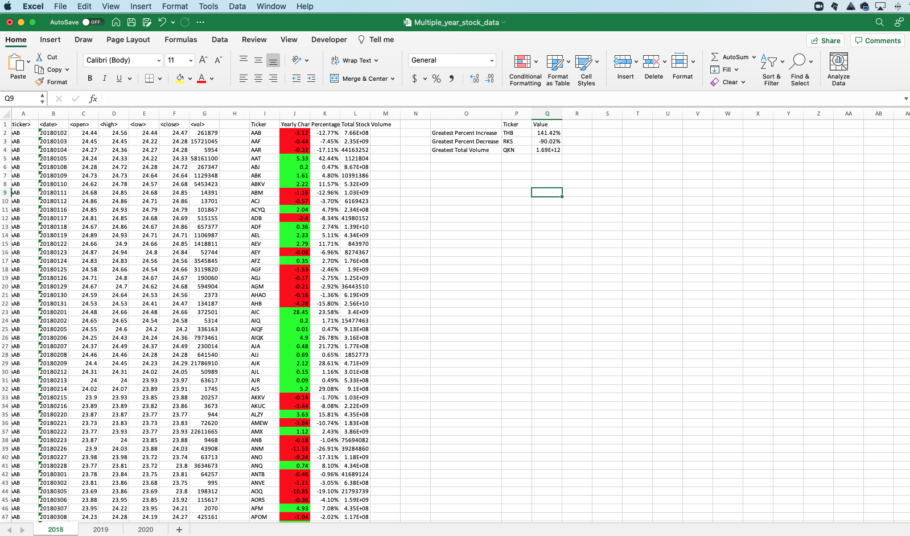
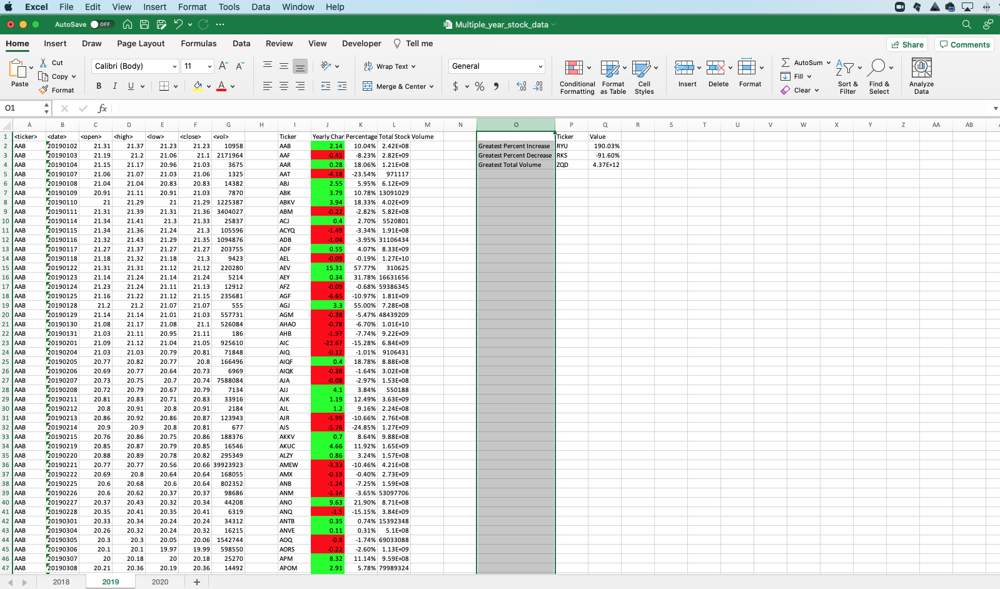
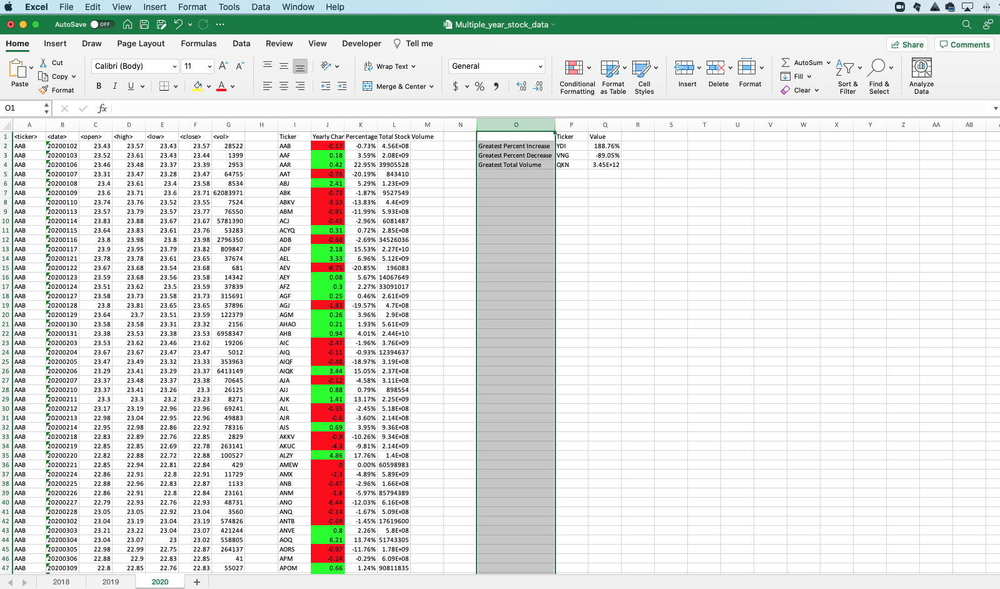

# WALL STREET STOCK ANALYSIS

The purpose of this project was to anaylyze stock market date using Visual Basic

A script was created to dymanically open/close prices; calculate volume; and change of any stock over a given year. 

